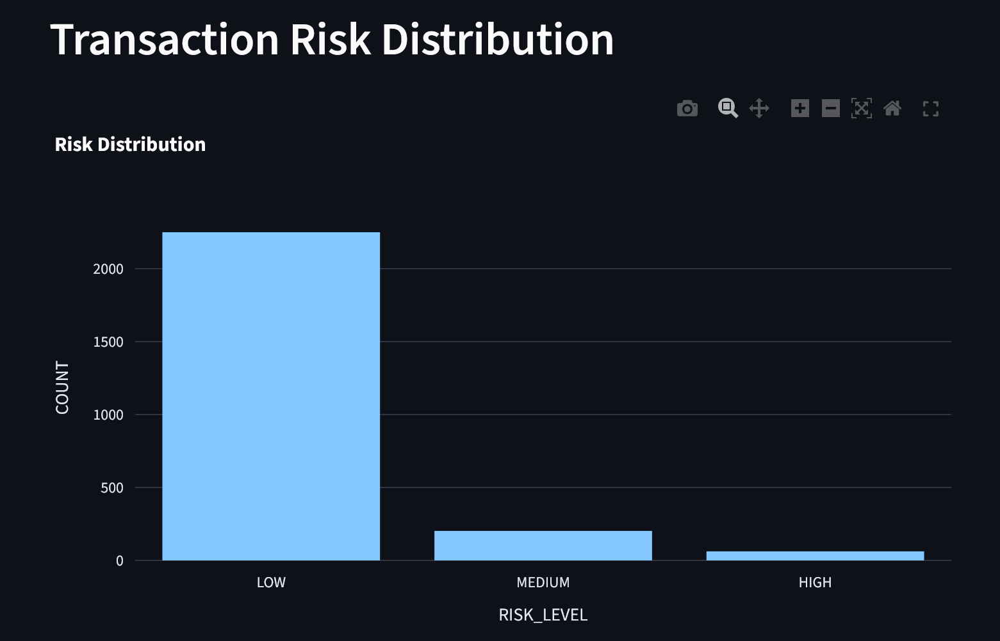
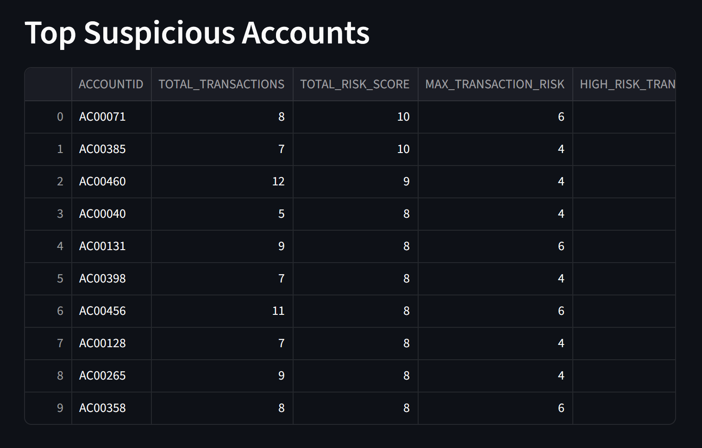
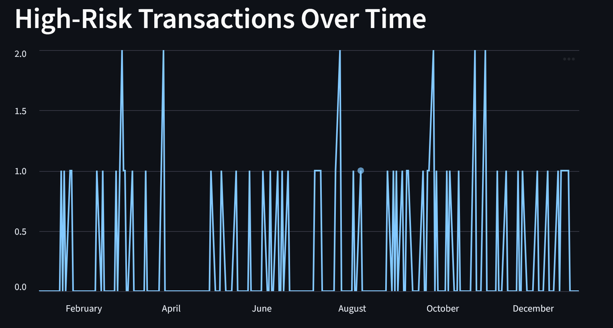
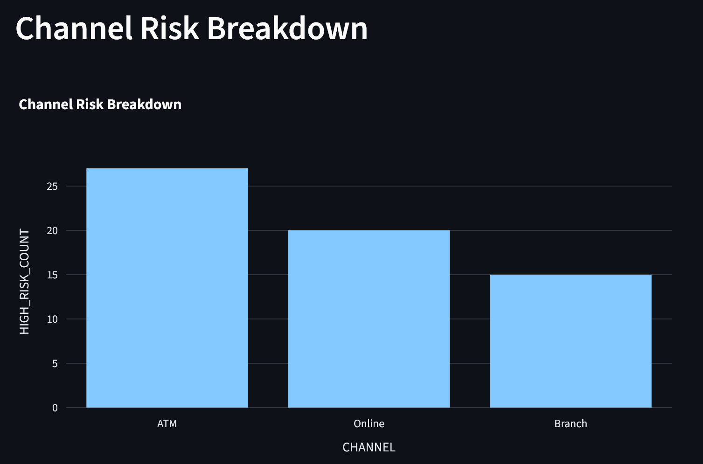

# Production-Grade Fraud Analytics ETL Pipeline (Snowflake + Streamlit)

## Overview

This project implements a production-style fraud analytics data pipeline using Snowflake as the core data warehouse and Streamlit for visualization. 

Raw banking transaction data is ingested into Snowflake and processed using a medallion architecture (Bronze → Silver → Gold). The pipeline performs type standardization, window-based behavioral feature engineering, percentile-driven anomaly detection, and weighted risk scoring. 

The final Gold layer exposes analytics-ready fact tables that power an interactive Streamlit dashboard for transaction- and account-level fraud analysis.

## Architecture Design

The pipeline follows a medallion architecture pattern:

- **Bronze Layer**: Raw ingestion of CSV data into Snowflake without transformation.
- **Silver Layer**: Data cleansing, timestamp conversion, schema standardization, and preparation for analytics.
- **Gold Layer**: Feature engineering, fraud signal generation, risk scoring, clustering optimization, and account-level aggregation.

This layered approach ensures data reliability, traceability, and scalability while separating ingestion from transformation and analytics logic. 

## Tech Stack

- Snowflake (Data Warehouse)
- SQL (Window Functions, Percentiles, Clustering)
- Python
- Streamlit
- Plotly

## Data Model

**fact_transactions**
- Transaction-level analytics table
- Fraud signal flags
- Weighted risk score
- Clustered by (AccountID, TransactionTimestamp)

**fact_account_risk**
- Account-level aggregation
- Total risk score
- High/Medium risk transaction counts
- Flagged account indicator

## Performance Optimization

- Implemented clustering on `fact_transactions` using `(AccountID, TransactionTimestamp)` to optimize pruning and analytical queries.
- Designed aggregation logic to reduce repeated computation in dashboard queries.
- Separated raw ingestion from analytics transformations for maintainability.

## Data Engineering Concepts

- Medallion architecture (Bronze/Silver/Gold)
- Window functions for behavioral analytics
- Percentile-based anomaly detection
- Risk scoring model
- Clustering for performance optimization
- Aggregation at transaction and account level
- Secure Snowflake integration via environment variables

## Fraud Risk Logic

Signals engineered:

- High-value transactions (95th percentile)
- Account-level Z-score anomaly detection
- Velocity detection (burst transactions)
- Login attempt risk
- Balance-drain detection

Weighted risk score used to classify:
- LOW
- MEDIUM
- HIGH risk transactions

## Results

- 2,512 transactions processed
- 495 accounts analyzed
- 62 high-risk transactions identified (~2.5% of total)
- 35 accounts flagged for investigation (~7% of total accounts)

The scoring model successfully isolates a small subset of high-risk behavior while preserving the majority of transactions as low-risk, reflecting realistic fraud detection distributions.

## Running Locally

1. Create conda environment
2. Install dependencies
3. Configure `.env`
4. Run:
